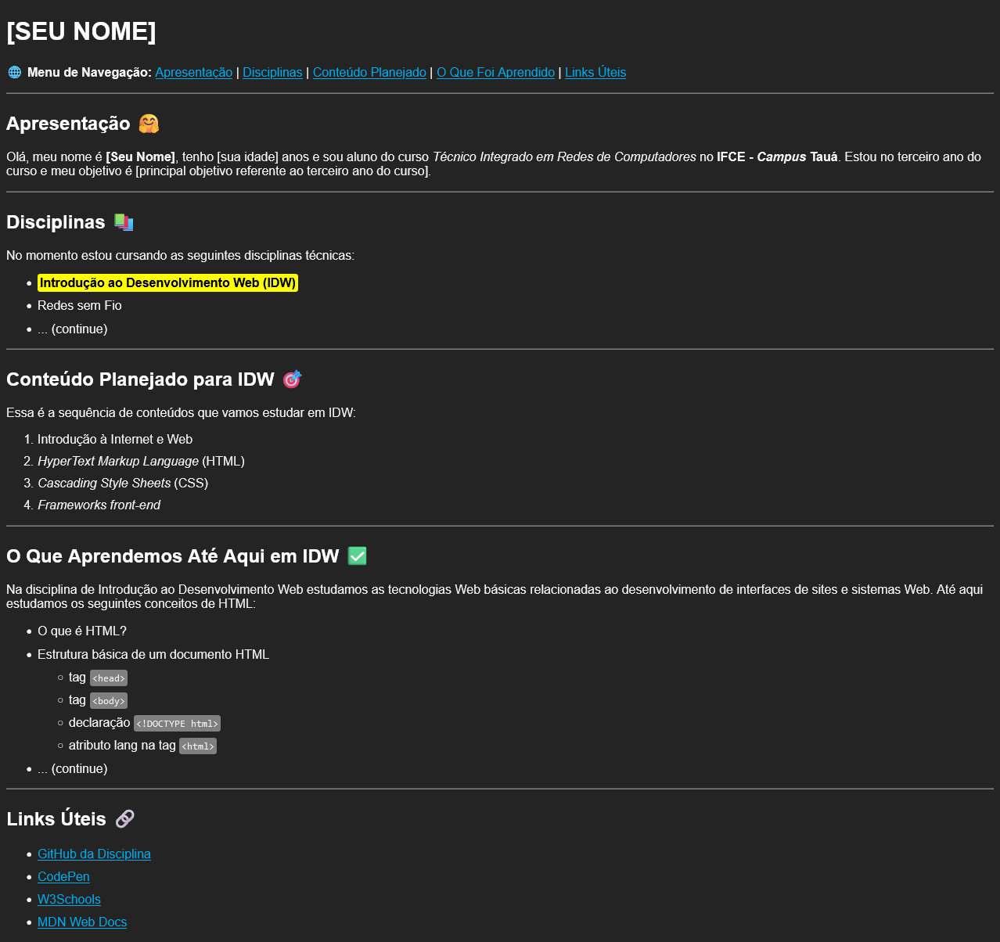

# Atividade Prática 03: CSS básico

> Nesta atividade vamos trabalhar os conceitos básicos de aplicação de CSS em páginas Web

[Acesse aqui](https://codepen.io/collection/ZQQjbg) a coleção da disciplina no CodePen.
[Acese aqui](../../../materiais/slides/) o material da disciplina.

## Instruções para Realização da Atividade

- Esta atividade tem o objetivo de exercitar a aplicação básica de CSS em páginas Web.

- A atividade consiste em aplicar regras CSS básicas, aprendidas em aula (tipografia, cores, espaçamentos e bordas), na página criada na [atividade 02](./../atv02/). 

- Além disso, também é objetivo desta atividade, trabalhar com HTML semântico para definir os elementos estruturais da página (áreas principais como: navegação, cabeçalho, main, seções e rodapé).

- O resultado deve ficar semelhante ao apresentado na imagem a seguir:

    

- **Instruções e Requisitos básicos para avaliação:**

    - Quem não fez a atividade 2, ou não conseguiu continuar a partir do código desenvolvido nela, pode [acessar aqui](./codigo-base/index.html) o código base para iniciar esta atividade;
    - Todas as estilizações referentes à formatação básica de textos devem ser aplicadas usando CSS. Exemplo: ao invés de usar a tag `b` para aplicar negrito em um texto, utilize a propriedade CSS `font-weight` com o valor `bold`;
    - Perceba que em todos os exemplos de tags citadas na página, um destaque foi aplicado com uma cor de plano de fundo e bordas arredondadas, bem como no destaque do nome da disciplina;
    - Os links também foram definidos com uma cor diferente da cor padrão;
    - Sintam-se livres para utilizar outras cores, porém tentem manter um bom contraste visual. Utilizem o site [Adobe Color](https://color.adobe.com/pt/create/color-contrast-analyzer) para fazer a verificação de contraste;
    - ***Você DEVE utilizar CSS externo***;
    - Compacte a pasta contendo os arquivos do projeto para o formato zip e anexem à entrega desta atividade no Classroom.
