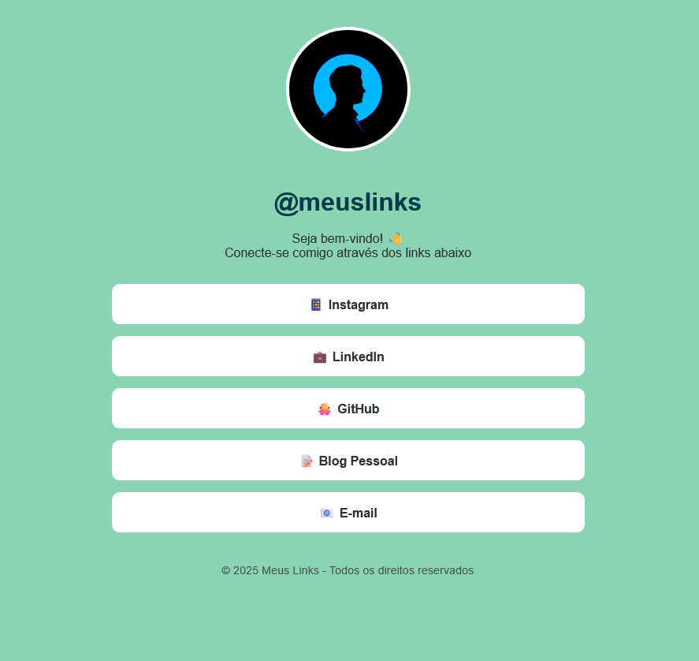
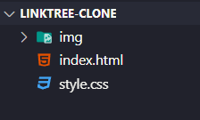

# Introdução ao Desenvolvimento Web - Redes 3

## Roteiro da Prática 04

> **Roteiro de Prática Guiada:** Página de Links Pessoais (Clone Linktree)
> 
> - **Objetivo:** construir uma página de links pessoais, estilo ***Linktree***, usando os conhecimentos aprendidos até aqui, além de novos conceitos e propriedades apresentados ao decorrer desta prática.
> - **Observações e Instruções Gerais:**
>   - Tente seguir o roteiro desta prática de forma a entender cada passo.
>   - Caso reste alguma dúvida, fique à vontade para perguntar.
>   - Use o **VS Code**. Não será possível utilizar o CodePen nesta prática, pois vamos construir uma estrutura mais completa para nosso projeto. 
>   - Após cada alteração, verifique como o resultado está ficando, para que você entenda a finalidade e o efeito de cada propriedade CSS aplicada.

---

### 1. Apresentação da Prática

- Esta prática tem o objetivo de construir uma página de links pessoais, estilo ***Linktree***, usando os conhecimentos aprendidos até aqui, além de novos conceitos e propriedades apresentados ao decorrer desta prática.

- O resultado esperado ao final desta prática é o seguinte: 

  <div style="width: 100%; margin: 0 auto">
    
  </div>

- O que vamos aplicar nesta prática?

  - Estruturação simples de um projeto web
  - Definição externa de CSS
  - Seletores CSS
  - Box Model CSS
  - Tipografia
  - Cores e backgrounds
  - Imagens

---

### **Passo 1: Estrutura Básica**  

1. Crie uma pasta para o projeto, pode dar o nome de `linktree-clone`

1. Dentro dessa pasta crie a seguinte estrutura (um arquivo **index.html**, um arquivo **style.css** e uma pasta **img**):

    <div style="width: 100%; margin: 0 auto; text-align: center;">
      
    </div>

1. No arquivo `index.html`, crie a estrutura básica do documento, linkando o arquivo CSS criado: 
    ```html
    <!DOCTYPE html>
    <html lang="pt-br">
    <head>
        <meta charset="UTF-8">
        <meta name="viewport" content="width=device-width, initial-scale=1.0">
        <title>Meus Links</title>
        <link rel="stylesheet" href="style.css">
    </head>
    <body>
        <!-- Conteúdo será adicionado -->
    </body>
    </html>
    ```

1. No aquivo `style.css`, vamos resetar algumas propriedades básicas:
    ```css
    /* Reset básico */
    * {
        margin: 0;
        padding: 0;
        box-sizing: border-box;
    }

    body {
        font-family: Arial, sans-serif;
        padding: 20px;
        background-color: #8ad4b4;
        min-height: 100vh;
        text-align: center;
    }
    ```
1. **Explicação do Código**

- Zeramos todos os espaçamentos (`margin` e `padding`) para todos os elementos de nossa página.
    - Usamos o seletor universal `*` para selecionar todos os elementos.
    - Além dos espaçamentos, definimos o modo como as dimensões do ***box model*** dos elementos seriam calculadas: `box-sizing: border-box` (leva em consideração **padding** e **borda** na definição da altura e da largura do elemento). 
- Definimos a estilização para o corpo da página (`body`), aplicando: 
    - `font-family`: para definir o tipo de letra (fonte)
    - `margin` e `padding`
    - `background-color`: para definir a cor de plano de fundo, usando o código da cor em hexadecimal ([consulte aqui](https://celke.com.br/artigo/tabela-de-cores-html-nome-hexadecimal-rgb) uma tabela de códigos de cores em Hexadecimal).
        - Não se preocupe, veremos mais detalhes sobre cores em CSS mais à frente.
    - `min-height`: altura mínima
    - `text-align`: para mudar o alinhamento do texto para `center` (centralizado)


**Conceitos Aprendidos:**  
- Vinculação de arquivos externos (`<link>`)  
- Reset CSS básico  
- Propriedade `box-sizing`
- Propriedades de cores e tipografia

---

### **Passo 2: Container Principal**  

1. No HTML (dentro de body):
    ```html
    <div class="container">
        <h1>@meuslinks</h1>
        <p>Seja bem-vindo! 👋<br>Conecte-se comigo através dos links abaixo</p>
    </div>
    ```

1. No CSS: 
    ```css
    .container {
        max-width: 600px;
        margin: 0 auto;
    }

    h1 {
        color: #003b4a;
        margin-bottom: 5px;
    }

    p {
        color: #2d3436;
        margin-bottom: 30px;
    }
    ```

---

### **Passo 3: Adicionar Imagem de Perfil**  

1. No HTML (dentro do container, antes do `h1`):
    ```html
    
    ```

1. No CSS:  
    ```css
    .foto-perfil {
        width: 150px;
        height: 150px;
        object-fit: cover;
        border-radius: 50%;
        border: 4px solid white;
        margin: 20px 0;
    }
    ```

---

### **Passo 4: Lista de Links**

1. No HTML (após o parágrafo):  
    ```html
    <ul class="links">
        <li class="link-item">
            <a href="#" class="btn">📱 Instagram</a>
        </li>
        <li class="link-item">
            <a href="#" class="btn">💼 LinkedIn</a>
        </li>
        <li class="link-item">
            <a href="#" class="btn">🐙 GitHub</a>
        </li>
    </ul>
    ```

1. No CSS:  
    ```css
    .links {
        list-style: none;
        padding: 0;
    }

    .link-item {
        margin: 15px 0;
        background-color: white;
        padding: 15px;
        border-radius: 10px;
    }

    .btn {
        text-decoration: none;
        color: #2d3436;
        font-weight: bold;
        display: block;
    }
    ```

---

### **Passo 5: Elementos Finais**  
1. No HTML (final do container, logo após o elemento `ul`):
    
    ```html
    <p class="creditos">© 2025 Meus Links - Todos os direitos reservados</p>
    ```

1. No CSS:
    ```css
    .creditos {
        margin-top: 40px;
        color: #465454;
        font-size: 0.9rem;
    }
    ```